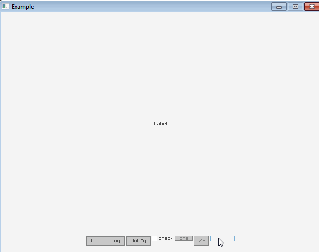

Fork of https://github.com/gen2brain/raylib-go/tree/master/raygui

- Add object-oriented API
- Add automatic layout containers (HBox, VBox)
- Fix Textbox
- Fix Combobox
- Add Application, Dialog, Notification
- Remove Toggle, Slider, Spinner

